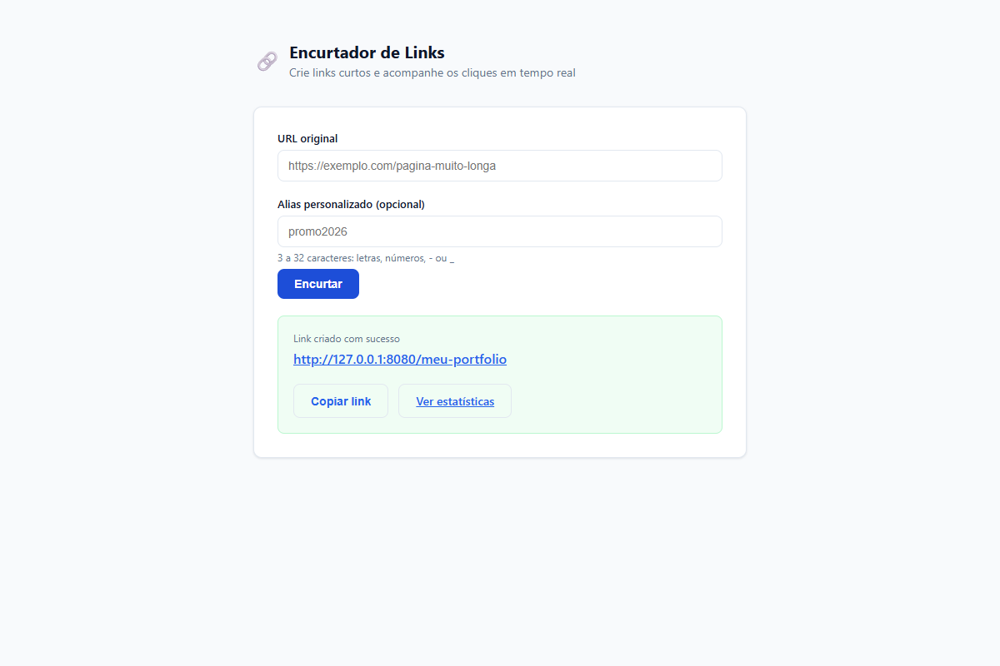
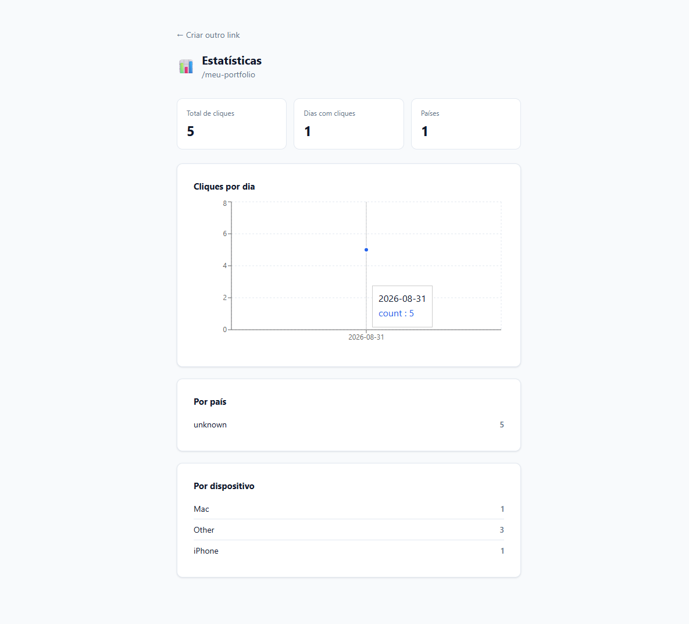

# 🔗 URL Shortener

Serviço de encurtamento de links no estilo Bitly: gera links curtos (com
alias personalizado opcional), redireciona para a URL original, registra
cada clique de forma assíncrona (geolocalização, dispositivo, navegador,
referrer) e exibe estatísticas agregadas em um dashboard.


## Demo




## Funcionalidades

- Criação de link curto com código aleatório ou **alias personalizado**
  (validado por unicidade, igual ao "back-half" do Bitly)
- Redirecionamento rápido via **cache Redis** (cache-aside: consulta o
  Redis primeiro, só cai no Postgres em cache miss)
- Registro de cliques **assíncrono** (não bloqueia o redirect): país/cidade
  via geolocalização de IP, dispositivo/navegador/SO via parsing de
  User-Agent, referrer
- Dashboard de estatísticas: total de cliques, série temporal diária,
  breakdown por país e por dispositivo
- Sem necessidade de conta/login — uso aberto

## Arquitetura

```
React (Vite) → Spring Boot API → PostgreSQL  (links, click_events)
                     │
                     └──────────→ Redis  (cache short_code → URL)
```

Decisão de design: estatísticas são calculadas via `COUNT`/agregação SQL
direto sobre a tabela `click_events`, em vez de um contador atômico no
Redis — mais simples e suficiente para o volume esperado, sem precisar
sincronizar contador com o banco. Detalhes completos em
[`docs/superpowers/specs/2026-08-30-url-shortener-design.md`](docs/superpowers/specs/2026-08-30-url-shortener-design.md).

## Stack

| Camada       | Tecnologia                                  |
|--------------|----------------------------------------------|
| Backend      | Java 21, Spring Boot 3.3, Flyway              |
| Banco        | PostgreSQL 16                                 |
| Cache        | Redis 7                                       |
| Frontend     | React 18, Vite, Recharts                      |
| Geolocalização | MaxMind GeoLite2 (offline)                  |
| Testes       | JUnit 5, Mockito, Testcontainers              |
| Infra        | Docker Compose, Nginx (serve o build do frontend) |
| CI           | GitHub Actions                                |

## Rodando localmente

Requer Docker Desktop instalado e rodando.

```bash
git clone https://github.com/eltonbarbosaa/url-shortener.git
cd url-shortener
docker compose up --build
```

- Frontend: http://localhost:5173
- API: http://localhost:8080

> **Nota (Windows):** se `curl`/o navegador travarem ao chamar `localhost`
> logo após instalar o Docker Desktop com WSL2, teste com `127.0.0.1`
> explicitamente — é um problema observado de resolução de `localhost`
> para IPv6 (`::1`) sem o encaminhamento de porta correspondente do Docker
> Desktop. Costuma sumir após reiniciar o Docker Desktop (ou o Windows).

## Deploy em produção

Guia passo a passo pra colocar no ar gratuitamente no Railway:
[`DEPLOY.md`](DEPLOY.md).

Geolocalização real dos cliques é opcional: baixe o banco GeoLite2 City da
MaxMind (gratuito, requer conta) e coloque em
`backend/src/main/resources/geoip/GeoLite2-City.mmdb` — sem ele, o campo
país/cidade simplesmente retorna "desconhecido", o resto funciona normal.

## Exemplo de uso (API)

```bash
# Criar um link com alias customizado
curl -X POST http://localhost:8080/api/links \
  -H "Content-Type: application/json" \
  -d '{"originalUrl":"https://github.com","customAlias":"meu-github"}'

# Seguir o link curto (302 redirect)
curl -i http://localhost:8080/meu-github

# Ver as estatísticas
curl http://localhost:8080/api/links/meu-github/stats
```

## Rodando os testes

```bash
cd backend
mvn test
```

Os testes de integração usam Testcontainers (Postgres + Redis reais em
container, não mocks) e exigem Docker rodando. Rodam automaticamente no
CI (GitHub Actions, Linux) a cada push/PR.

> **Nota (Windows):** em algumas instalações do Docker Desktop, a lib
> `docker-java` usada pelo Testcontainers não detecta o daemon via named
> pipe, mesmo com `docker info` funcionando normalmente pelo CLI — é uma
> incompatibilidade conhecida entre `docker-java` e versões recentes do
> Docker Desktop no Windows, não um problema do projeto. O CI do GitHub
> Actions roda em Linux e não sofre com isso.

## Documentação do processo

Este projeto foi desenvolvido com spec e plano de implementação escritos
antes do código:

- [Spec de design](docs/superpowers/specs/2026-08-30-url-shortener-design.md)
- [Plano de implementação](docs/superpowers/plans/2026-08-30-url-shortener.md)

## Licença

MIT
